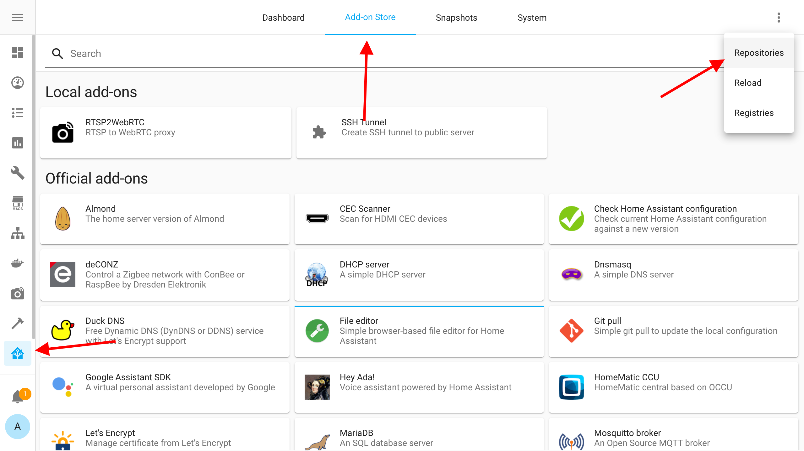
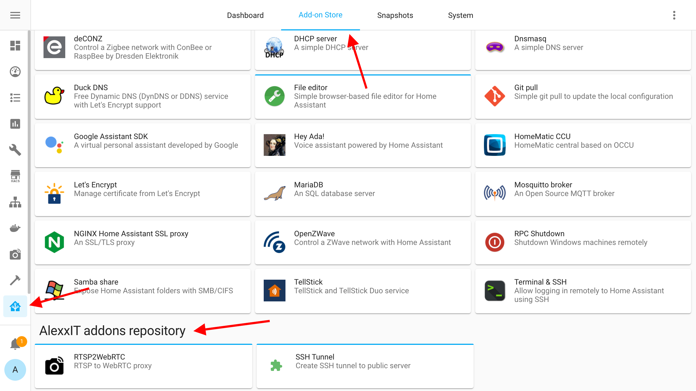
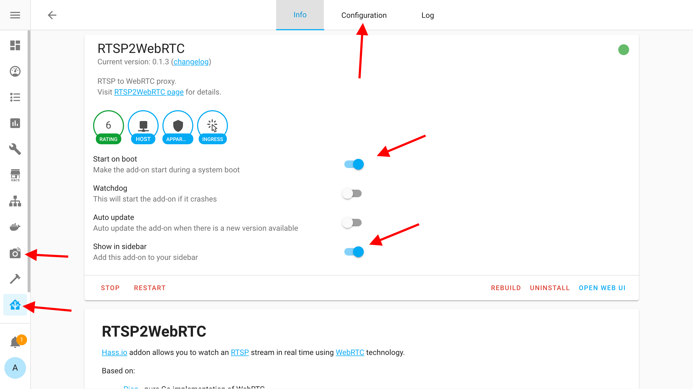

# AlexxIT Hass.io addons

- [RTSP2WebRTC](https://github.com/AlexxIT/hassio-addons/tree/master/rtsp2webrtc) - watch an [RTSP](https://en.wikipedia.org/wiki/Real_Time_Streaming_Protocol) stream in **real time** (without any delay) using [WebRTC](https://en.wikipedia.org/wiki/WebRTC) technology
- [SSH Tunnel](https://github.com/AlexxIT/hassio-addons/tree/master/ssh_tunnel) - external access to Hass via VPS server tunnel

# Install

You must using [Hass.io](https://www.home-assistant.io/hassio/) - supervised [Home Assistant](https://www.home-assistant.io/) version with addon support.

**Add addon repository**

`https://github.com/AlexxIT/hassio-addons`

**Install addon**

**Config addon**

